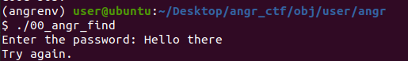
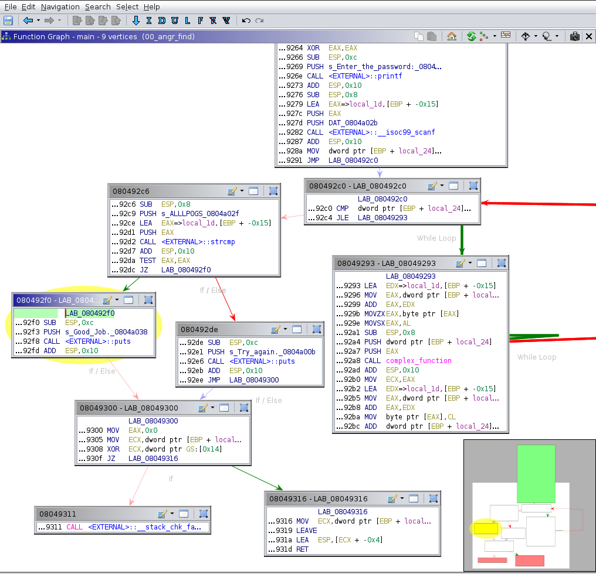
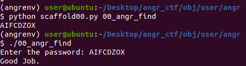

# 00 angr find

The first and most natural thing to do, is to execute the binary with `./00_angr_find`. The program will ask you to enter a password. You can enter whatever you want to test it, but unless you're lucky or smart enough to guess the password on the first try, you'll get a message telling you to "Try again."



You can open the binary in a decompiler, you'll see that the  goal of this first challenge is to find an input so that the program prints "Good job."



Using Ghidra to find the pseudo-C code gives the following code:
```c
undefined4 main(undefined4 param_1,undefined4 param_2)

{
  char cVar1;
  int iVar2;
  int in_GS_OFFSET;
  int local_24;
  char local_1d [9];
  int local_14;
  undefined *local_c;
  
  local_c = (undefined *)&param_1;
  local_14 = *(int *)(in_GS_OFFSET + 0x14);
  printf("Enter the password: ");
  __isoc99_scanf(&DAT_0804a02b,local_1d);
  for (local_24 = 0; local_24 < 8; local_24 = local_24 + 1) {
    cVar1 = complex_function((int)local_1d[local_24],local_24);
    local_1d[local_24] = cVar1;
  }
  iVar2 = strcmp(local_1d,"ALLLPOGS");
  if (iVar2 == 0) {
    puts("Good Job.");
  }
  else {
    puts("Try again.");
  }
  if (local_14 != *(int *)(in_GS_OFFSET + 0x14)) {
                    /* WARNING: Subroutine does not return */
    __stack_chk_fail();
  }
  return 0;
}
```

In a "traditional" reverse engineering challenge, you would want to reverse engineer the function `complex_function` to find the right input, but I think it's too *complex* ... (hehe I've made a pun in case you didn't notice)

```c
int complex_function(int param_1,int param_2)

{
  if ((0x40 < param_1) && (param_1 < 0x5b)) {
    return (param_1 + -0x41 + param_2 * 3) % 0x1a + 0x41;
  }
  puts("Try again.");
                    /* WARNING: Subroutine does not return */
  exit(1);
}
```

Our solution will rely on Symbolic Execution. 
> * Symbolic execution explores every execution path to a certain target.
> * Inputs are represented as symbolic values, and an execution path is represented as a logical formula called path predicate.
> * The path is satisfiable if there is an assignment of concrete values to the symbolic variables such that the predicate is evaluated as true.

For this we will use [angr](https://github.com/angr/angr).

Take a look at the file `scaffold00.py`, you'll understand that you need to replace the first `???` by the path to the binary and the second `???` by our target address, which is the address that prints "Good jobs.". In our case it's `0x080492f0` but it might be different for you.



Solution:
```py
import angr
import sys

def main(argv):
  path_to_binary = argv[1]  # :string
  project = angr.Project(path_to_binary)

  initial_state = project.factory.entry_state(
    add_options = { angr.options.SYMBOL_FILL_UNCONSTRAINED_MEMORY,
                    angr.options.SYMBOL_FILL_UNCONSTRAINED_REGISTERS}
  )
  simulation = project.factory.simgr(initial_state)

  print_good_address = 0x080492f0 # :integer (probably in hexadecimal)
  simulation.explore(find=print_good_address)
  
  if simulation.found:
    solution_state = simulation.found[0]
    print(solution_state.posix.dumps(sys.stdin.fileno()).decode())
  else:
    raise Exception('Could not find the solution')

if __name__ == '__main__':
  main(sys.argv)
```