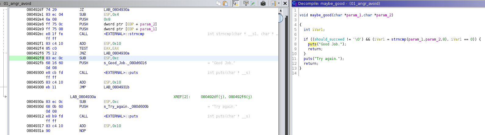
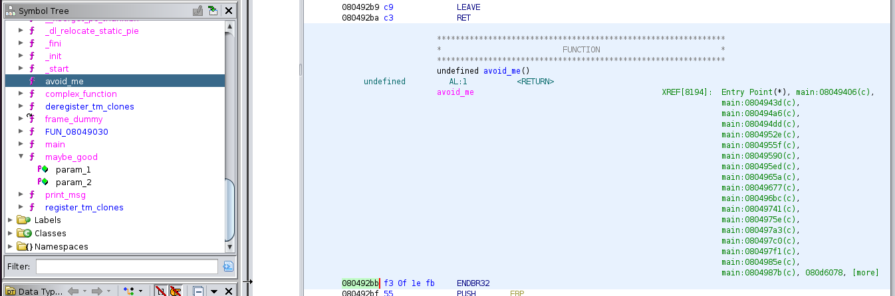
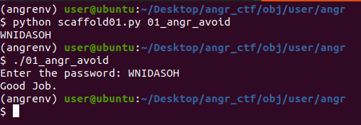

# 01 angr avoid

As for `00_angr_find`, the goal is still to find an input that makes the program print "Good job."

If you try to open the binary `01_angr_avoid` in IDA (free) or Ghidra, you'll notice the program is so big that you can't view in graph mode or even view the pseudo-C code in Ghidra.

But remember, we need to target the succes address, the one that prints "Good job.", as long as we can avoid the useless parts of the program it's okey.

By examining the binary, you'll find 2 interesting functions : `avoid_me` and `maybe_good`.

We check the pseudo code and disassembler for `maybe_good` and we see that there's our call to print "Good job.", we've got our target address!



However, it is not enough. The program is so big that the symbolic execution will have some trouble. Luckily, `angr` let's you avoid some addresses. It might be pretty straight forward that we should avoid the function called `avoid_me`



Now we juste have to replace our addresses in the file scafflod01.py and voilà!



Solution:

```py
import angr
import sys

def main(argv):
  path_to_binary = argv[1]
  project = angr.Project(path_to_binary)
  initial_state = project.factory.entry_state(
    add_options = { angr.options.SYMBOL_FILL_UNCONSTRAINED_MEMORY,
                    angr.options.SYMBOL_FILL_UNCONSTRAINED_REGISTERS}
  )
  simulation = project.factory.simgr(initial_state)

  print_good_address = 0x080492f8
  will_not_succeed_address = 0x080492bb
  simulation.explore(find=print_good_address, avoid=will_not_succeed_address)

  if simulation.found:
    solution_state = simulation.found[0]
    print(solution_state.posix.dumps(sys.stdin.fileno()).decode())
  else:
    raise Exception('Could not find the solution')

if __name__ == '__main__':
  main(sys.argv)

```